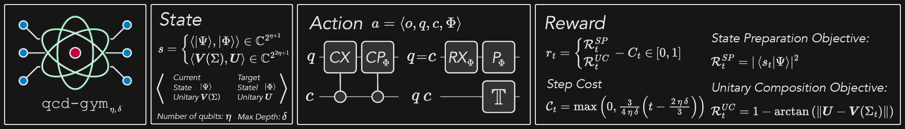
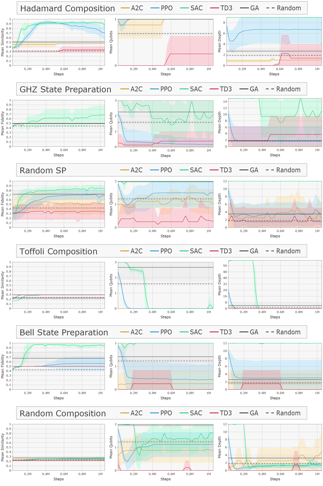

# Quantum Circuit Designer

[](https://arxiv.org/abs/2312.11337)
[](https://badge.fury.io/py/qcd-gym)


## **Description**

This repository contains the Quantum Circuit Designer, a generic [gymnasium](https://github.com/Farama-Foundation/Gymnasium) environment to build quantum circuits gate-by-gate using [pennylane](https://github.com/PennyLaneAI/pennylane), revealing current challenges regarding:

- [State Preparation (SP)](#state-preparation): Find a gate sequence that turns some initial state into the target quantum state.
- [Unitary Composition (UC)](#unitary-composition): Find a gate sequence that constructs an arbitrary quantum operator.


## Observations

The observation is defined by the full complex vector representation of the state of the current circuit: $s = \ket{\boldsymbol{\Psi}}\in\mathbb{C}^{2^\eta}$. 
While this information is only available in quantum circuit simulators efficiently (on real hardware, $\mathcal{O}(2^\eta)$ measurements would be needed), it depicts a starting point for RL from which future work should extract a sufficient, efficiently obtainable, subset of information.
This $2^\eta$-dimensional state representation is sufficient for the definition of an MDP-compliant environment, as operations on this state are required to be reversible. 

## Actions

We use a $4$-dimensional `Box` action space $\langle o, q, c, \Phi \rangle = a \in \mathcal{A} = \{\Gamma \times \Omega \times \Theta\}$ with the following elements:

| Name      | Parameter             | Type  | Description                             |
| --------- | --------------------- |-------| :-------------------------------------- |
| Operation | $o \in \Gamma$        |`int`  | specifying operation (see next table)   |
| Qubit     | $q \in[0, \eta)$      |`int`  | specifying qubit to apply the operation |
| Control   | $c \in[0, \eta)$      |`int`  | specifying a control qubit              |
| Parameter | $\Phi \in[- \pi,\pi]$ |`float`| continuous parameter                    |

The operations $\Gamma$ are defined as: 

| o | Operation    | Condition  | Type                 | Arguments  | Comments                      |
| - | ------------ | ---------- | -------------------- | ---------- | :---------------------------- |
| 0 | $\mathbb{M}$ |            | Meassurement         | $q$        | Control and Parameter omitted |
| 1 | $\mathbb{Z}$ | $q = c$    | PhaseShift           | $q,\Phi$   | Control omitted               |
| 1 | $\mathbb{Z}$ | $q \neq c$ | ControlledPhaseShift | $q,c,\Phi$ | -                             |
| 2 | $\mathbb{X}$ | $q = c$    | X-Rotation           | $q,\Phi$   | Control omitted               |
| 2 | $\mathbb{X}$ | $q \neq c$ | CNOT                 | $q,c$      | Parameter omitted             |
| 3 | $\mathbb{T}$ |            | Terminate            |            | All agruments omitted         |

With operations according to the following unversal gate set:

- CNOT: $$CX_{q,c} = \ket{0}\bra{0}\otimes I + \ket{1}\bra{1}\otimes X$$
- X-Rotation: $$RX(\Phi) = \exp\left(-i \frac{\Phi}{2} X\right)$$
- PhaseShift: $$P(\Phi) =  \exp\left(i\frac{\Phi}{2}\right) \cdot \exp\left(-i\frac{\Phi}{2} Z\right)$$
- ControlledPhaseShift: $$CP(\Phi) = I \otimes \ket{0} \bra{0} + P(\Phi) \otimes \ket{1} \bra{1}$$

## Reward

The reward is kept $0$ until the end of an episode is reached (either by truncation or termination).
To incentivize the use of few operations, a step-cost $\mathcal{C}_t$ is applied when exceeding two-thirds of the available operations $\sigma$:
$$\mathcal{C}_t=\max\left(0,\frac{3}{2\sigma}\left(t-\frac{\sigma}{3}\right)\right)$$

Suitable task reward functions $\mathcal{R}^{\*}\in[0,1]$ are defined, s.t.: $\mathcal{R}=\mathcal{R}^{\*}(s_t,a_t)-C_t$ if $t$ is terminal, according to the following challenges:

## Challenges

### **State Preparation**

The objective of this challenge is to construct a quantum circuit that generates a desired quantum state.
The reward is based on the *fidelity* between the target an the final state:
$$\mathcal{R}^{SP}(s_t,a_t) = F(s_t, \Psi) = |\braket{\psi_{\text{env}}|\psi_{\text{target}}}|^2 \in [0,1]$$
Currently, the following states are defined:
- `'SP-random'` (a random state over *max_qubits* )
- `'SP-bell'` (the 2-qubit Bell state)
- `'SP-ghz<N>'` (the `<N>` qubit GHZ state)

### **Unitary Composition**

The objective of this challenge is to construct a quantum circuit that implements a desired unitary operation.
The reward is based on the ***Frobenius norm*** $D = |U - V(\Sigma_t)|_2$ between the taget unitary $U$ and the final unitary $V$ based on the sequence of operations $\Sigma_t = \langle a_0, \dots, a_t \rangle$: 

$$ R^{UC}(s_t,a_t) = 1 - \arctan (D)$$

<!-- For the reward function, an 1-arctan mapping of the ***Frobenius norm*** $|U_{\text{env}} - U_{\text{target}}|_2$ to the interval $[0,1]$ is chosen.  -->
The following unitaries are currently available for this challenge:

- `'UC-random'` (a random unitary operation on *max_qubits* )
- `'UC-hadamard'` (the single qubit Hadamard gate)
- `'UC-toffoli'` (the 3-qubit Toffoli gate)

See [Outlook](#outlook-and-todos) for more challenges to come.

### *Further Objectives*

The goal of this implementation is to not only construct any circuit that fulfills a specific challenge but to also make this circuit optimal, that is to give the environment further objectives, such as optimizing:

- Circuit Depth
- Qubit Count
- Gate Count (or: 2-qubit Gate Count)
- Parameter Count
- Qubit-Connectivity

These circuit optimization objectives can be switched on by the parameter `punish` when initializing a new environment.

Currently, the only further objective implemented in this environment is the **circuit depth**, as this is one of the most important features to restrict for NISQ (noisy, intermediate-scale, quantum) devices. This metric already includes gate count and parameter count to some extent. However, further objectives can easily be added within the `Reward` class of this environment (see [Outlook](#outlook)).


## **Setup**

Install the quantum circuit designer environment

```sh
pip install qcd-gym
```

The environment can be set up as:

```python
import gymnasium as gym

env = gym.make("CircuitDesigner-v0", max_qubits=2, max_depth=10, challenge='SP-bell', render_mode='text', verbose=True)
observation, info = env.reset(seed=42); env.action_space.seed(42)

for _ in range(9):
  action = env.action_space.sample()  # this is where you would insert your policy
  observation, reward, terminated, truncated, info = env.step(action)
  if terminated or truncated: observation, info = env.reset()

env.close()
```

The relevant parameters for setting up the environment are:

| Parameter          | Type   | Explanation                                                  |
| :----------------- | ------ | ------------------------------------------------------------ |
| max_qubits $\eta$  | `int`  | maximal number of qubits available                           |
| max_depth $\delta$ | `int`  | maximal circuit depth allowed (= truncation criterion)       |
| challenge          | `str`  | RL challenge for which the circuit is to be built (see [Challenges](#challenges)) |
| punish             | `bool` | specifier for turning on multi-objectives (see [Further Objectives](#further-objectives)) |


## Running benchmarks 

Running benchmark experiments requires a full installation including baseline algorithms extending [stable_baselines3](https://github.com/DLR-RM/stable-baselines3) and a plotting framework extending [plotly](https://github.com/plotly/plotly.py):
This can be achieved by:
```sh
git clone https://github.com/philippaltmann/QCD.git
pip install -e '.[all]'
```

Specify the intended \<Challenge\> as: "`challenge`-q`max_qubits`-d`max_depth`":

```sh
# Run a specific algoritm and challenge (requires `pip install -e '.[train]'`)
python -m train [A2C | PPO | SAC | TD3] -e <Challenge>

# Generate plots from the `results` folder (requires `pip install -e '.[plot]'`)
python -m plot results

# To train the provided baseline algorithms, use (pip install -e .[all])
./run

# Test the circuit designer (requires `pip install -e '.[test]'`)
python -m circuit_designer.test
```

## Results 




## Acknowledgements

The research is part of the [Munich Quantum Valley](https://www.munich-quantum-valley.de), which is supported by the Bavarian state government with funds from the [Hightech Agenda Bayern Plus](https://www.hightechagenda.de).


